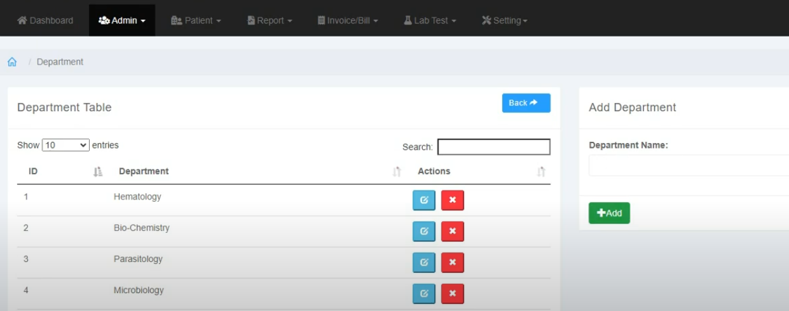

# 🏥 Clinic Management System

A comprehensive clinic management solution built with PHP Laravel framework, designed to streamline medical operations and patient care.

## ✨ Key Features

### 🎛️ Admin Dashboard

- Complete system control
- User role management
- Automated backups

### 👨‍⚕️ Doctor & Patient Management


- Electronic health records
- Staff scheduling
- Treatment history tracking

### 📅 Appointment System

- Interactive calendar
- Automated reminders
- Resource allocation

## 🛠️ Technology Stack

| Backend | Frontend | Database |
|---------|----------|----------|
|  PHP 8 |  Bootstrap |  MySQL |
|  Laravel 10 |  JavaScript | |

## ✏️ Author <a name="author"></a>

[](https://github.com/Ingridvasc)
[](https://www.linkedin.com/in/ingrid-karoline-vasconcelos-da-silva-18635a230/)


## 🚀 Installation

```bash
# Clone repository
git clone https://github.com/ingridvasc/clinic-management-system.git
cd clinic-management-system

# Install dependencies
composer install
npm install

# Setup environment
cp .env.example .env
php artisan key:generate

# Run migrations
php artisan migrate --seed

# Start server
php artisan serve
